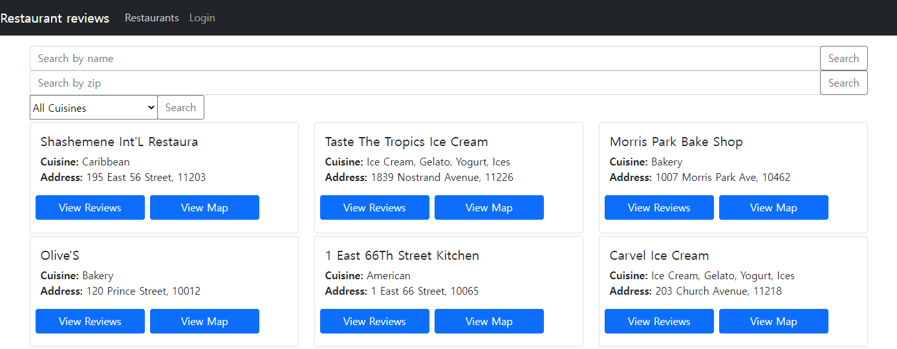

<h1 align="center">[MERN Toy Project] Restaurant Reviews</h1>

🔥 Toy Clone project using MERN Stack, courtesy of *freeCodeCamp.org*.
 

This website allows user to search restaurants by name, zip code, and cuisine type. User can click [View Map] to locate the restaurant on Google Map, or click [View Reviews] to read reviews. They can also login to leave their own reviews.

레스토랑을 검색하고 리뷰를 남길 수 있는 웹사이트입니다. 이름, ZIP 코드, 음식 종류로 레스토랑을 검색할 수 있습니다. [View Map]을 클릭해 구글 맵에서 위치를 확인할 수 있습니다. [View Reivews]를 클릭해 등록된 리뷰를 확인할 수 있으며, 로그인해 직접 리뷰를 남길 수 있습니다.

✔️ Created `2021-08-23` 
✔️ Using `React` `bootstrap` `axios` `Node.js` `express` `MongoDB` 

 

  

## Install

To host the website on local server:
1. Clone the repository.
2. On terminal, get frontend running by `cd frontend` ➔ `npm i` ➔ `npm start`
3. Get backend running by `cd backend` ➔ `nodemon server` ➔ `nodemon server`

## Features

#### 1) Search Restaurants
To search for a restaurant, use search bars at the top of the page. Search by name, zip code, or cuisine type.

- Searching by name only filters word-level match. `Piz` will not return titles that contain `Pizza`.

#### 2) View Map
To see where the restaurant is located, click [View Map] button. This will open in a new tab with the Google Map search result.

#### 3) Log In
Log In is required to create, edit, or delete reviews. Sign Up is currently not provided. Simply giving any random Username and ID will create a new account. 

#### 4) Reviews
User can add any number of reviews. Reviews are visible to all users, but you can only edit or delete reviews you created.
